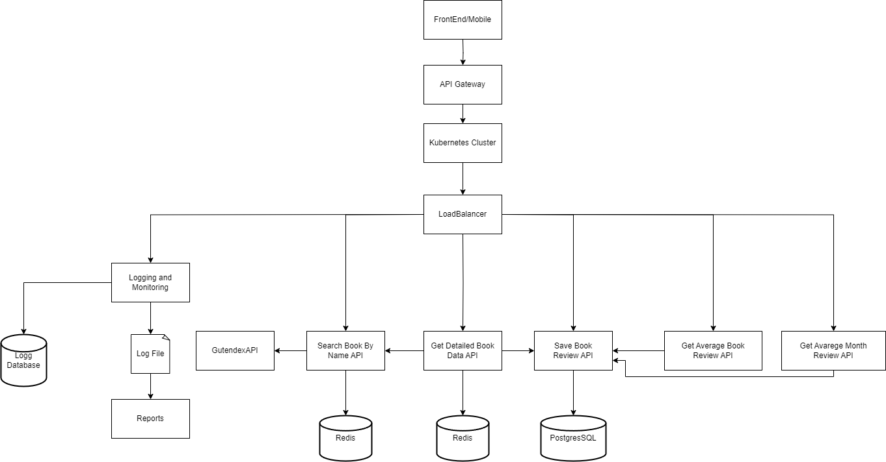

# Think Process
In this file I will try to demonstrate my thought process for creating the application. During development
a lot of things cross my mind, but I'll try to list the main ones, but I may have forgotten something.
After reading the requirements and needs of the system, I chose to make a monolith because I understood that since it is for internal use, 
the system will not have many requests, and there would be no need to scale it.
After reading and understanding the requirements and how the 3rd party API works. Define the following goals

#### Definition of the framework to be used:
After understanding the system requirements, I came to the conclusion that the SpringBoot Framework would be a good tool to solve the problem that the system proposes to solve.

### Delimited context definition.

The delimited context I chose is called BookReview, as the requirements say that we should only save the reviews of a certain book, not the information of the book itself (this comes from the third-party api).

### API development

After defining the tool and the delimited context, start working on the development of the application itself, focusing on writing code following principles such as SOLID, TDD. I used docker as an ally when creating project dependencies, such as Postgres and Redis databases.

### Next Steps
If the system is going to be launched in the market. I would make some architectural changes.

- I would change the monolithic system for a system using microservice.
- Each API would be a microservice, with its own database, and each microservice having its responsibility, by doing 
this, we could, if necessary, scale the APIs as needed, using an orchestrator for this, such as Kubernetes.
When using a microservice, we also have the freedom to write each microservice with the best technology to solve 
that problem.
- Added Log analysis and monitoring tools. Important tools because given the microservice context, 
these tools are allies to understand if the microservices are healthy, which microservice is receiving more 
requests, etc.
- Creation of a CI/CD pipeline, and within this pipeline I would run the tests to try to prevent as 
much as possible the addition of new bugs to the system.

I have tried to demonstrate this process in the following diagram

